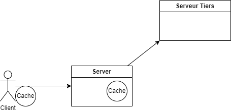
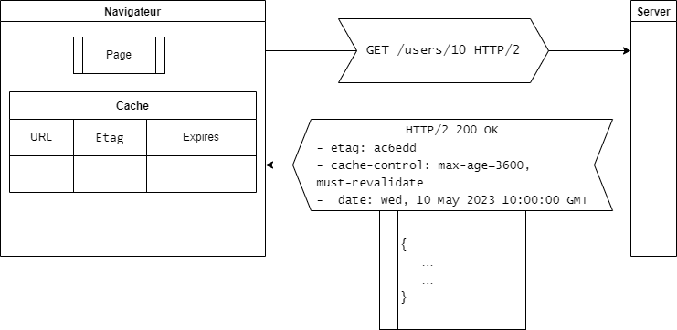
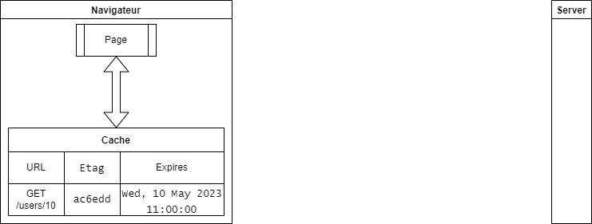
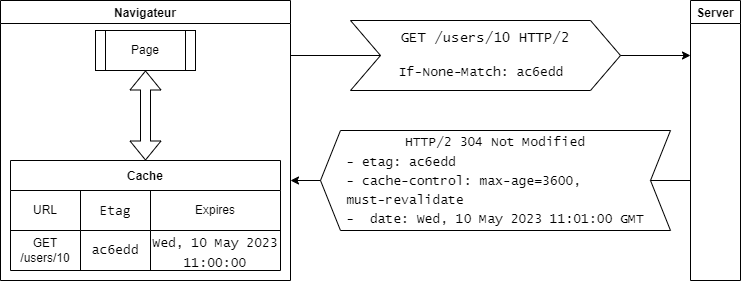
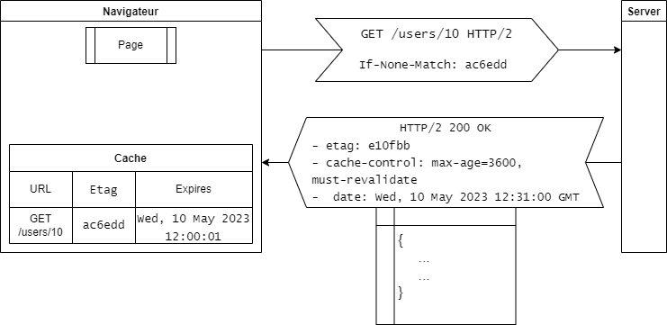

# Green IT côté serveur

---

## Rappels Green IT

- eco - conception de services numériques

---

## Le Green IT c'est surtout ... à la conception

- Créer une architecture applicative modulaire
- Choisir un format de données adapté
- Éliminer les fonctionnalités non essentielles
- Réduire le volume de données stockées au strict nécessaire / Mettre en place une politique d'expiration et suppression des données
- Faire preuve de frugalité dans la présentation et dans le déplacement des données

---

## Le Green IT c'est surtout ... côté utilisateurs

- Nombreuses bonnes pratiques pour le développement front
- **Limiter l'obsolescence des terminaux utilisateurs**
- Limiter la consommation des terminaux utilisateurs !

---

## Parlons des serveurs

- Particularité des serveurs et du réseau :
  - équipements rentabilisés
  - il faut en maîtriser la consommation
- Attention aux impacts des développements sur les serveurs pour le client :
  - pagination
  - protocoles
  - caches côté client

---

## Les serveurs et la consommation : principes

- Installer le minimum requis sur le serveur
- Mettre en place une architecture élastique
- Réduire au nécessaire les logs des serveurs
- Utiliser la version la plus récente du langage

---

## Les serveurs et la consommation : configuration

- de petits incréments ?

---

## Limiter la consommation serveur et réseau : les caches

- Principe des caches
  - ne pas redépenser du temps/de la ressource pour une donnée qui a déjà été obtenue
  - Durée de vie
  - Partage des caches

---

## Schéma des caches

---

## Caches http (principe)

- l'utilisation du cache http côté client s'envisage à chaque requête pour stoquer la réponse obtenue suivant les instructions dans les en-têtes.
- lors de la réutilisation d'une ressource (url identique), le navigateur vérifie si elle est en cache et utilisable directement

---

## Caches http (en-têtes pour les `GET`)

- l'en-tête **`Cache-Control` reçue lors de la première réponse déclenche l'utilisation du cache côté client
  - `Cache-Control: no-store` : **aucune mise en cache**. à chaque nouvelle "requête"  :
    - => ☹ recalcul côté serveur 🔥
    - => ☹ renvoi des données sur le réseau 🔥
  - `Cache-Control: max-age=31536000` (s) : **mise en cache pendant un an**. à chaque nouvelle "requête" :
      - => 🙂 aucun recalcul côté serveur 🍃
      - => 🙂 aucun envoi des données sur le réseau 🍃
  <!--pour les ressources statiques qui ne changent pas-->
  - `Cache-Control: no-cache` : **mise en cache, revalidation systématique**. à chaque nouvelle requête :
     - => ☹ recalcul côté serveur 🔥
     - => 🙂 aucun envoi des données sur le réseau 🍃 (_si pas de changement_)
- l'en tête `ETag` contient un hash de la ressource calculé côté serveur et utilisé lors de la **revalidation** d'une ressource mise en cache :
  - envoi d'une requête `GET` par le navigateur avec en-tête `If-None-Match: ${etag.value}`
    - réponse `304 Not modified` sans body si le hash recalculé par le serveur est identique
    - réponse `200 OK` avec la ressource dans le body sinon
- enfin `Cache-Control: must-revalidate, max-age=600` : **`must-revalidate`** indique au serveur qu'il doit revalider la ressource lorsqu'elle périme après 10 min

<!--vider le cache du navigateur : ctrl + shift + suppr
cache firefox : `about:cache`-->

---

## Exemple `Cache-Control: must-revalidate, max-age=3600`

**Première requête à 10h**

---

## Exemple `Cache-Control: must-revalidate, max-age=3600`

**Deuxième requête à 10h30**

---

## Exemple `Cache-Control: must-revalidate, max-age=3600`

**Troisième requête à 11h01**

---

## Exemple `Cache-Control: must-revalidate, max-age=3600`

**Quatrième requête à 12h31**

---

## [Comment déterminer son en-tête `Cache-Control`](https://web.dev/http-cache/#flowchart)

---

## Mettre en oeuvre le `Cache-Control` côté backend

- Avec Spring MVC
  - [API pour l'en-tête `Cache-Control`](https://docs.spring.io/spring-framework/reference/web/webmvc/mvc-caching.html#mvc-caching-cachecontrol)
  - [Filtre pour écrire les en-têtes `etag` et intercepter `If-None-Match`](https://docs.spring.io/spring-framework/reference/web/webmvc/filters.html#filters-shallow-etag)
  - NB : pour les usages standards, il est préférable de laisser le filtre ShallowEtagHeaderFilter gérer entièrement les en-têtes `eTag` plutôt que de faire cela manuellement dans le contrôleur

---

## Caches applicatifs

- Au niveau du serveur applicatif :
  - limiter la sollicitation des autres ressources (réseau) 🍃🍃🍃
  - préserver les ressources de calcul 🍃
  - Répondre plus rapidement aux requêtes utilisateur 🙂
- Infinispan à l'Insee <!--TODO lien-->
  - Intégration avec [l'API de cache applicatif Spring](https://docs.spring.io/spring-framework/docs/current/reference/html/integration.html#cache)
  - [Infinispan bientôt naturellement non bloquant](https://infinispan.org/blog/2023/04/24/infinispan-15dev01)
- Principe simple :
  - pour une méthode idempotente
  - à chaque premier appel à la méthode avec des arguments donnés, on met en cache la réponse calculée
  - aux appels suivants avec les mêmes arguments, on ressert la même valeur sans refaire le calcul
- Expiration et éviction
- Cache partagé (distribué ou répliqué) entre plusieurs instances de l'application

---

## Le cache applicatif avec Spring

- [Intégration de Infinispan avec Spring boot](https://infinispan.org/docs/stable/titles/spring_boot/starter.html) (ne pas oublier `@EnableCaching` pour utiliser [l'abstraction Spring du cache](https://docs.spring.io/spring-framework/docs/6.0.8/reference/html/integration.html#cache-annotations))
- Le cache applicatif permet au sein de l'application de cacher des réponses qui nécessitent beaucoup de calcul ou des données récupérées fréquemment de la BDD
- Pour cacher les réponses d'un WS tiers, on privilégiera l'utilisation d'un cache de client http

---

## Utilisation du cache d'un client http avec un WS tiers

- Pour mettre en cache les réponses d'un WS tiers utilisant des en-têtes `cache-control` et `etag` il vaut mieux utiliser un client http qui le gère nativement comme [OkHttp](https://square.github.io/okhttp/features/calls/)
- A combiner avec un client REST de plus haut niveau comme [Spring Cloud OpenFeign](https://www.baeldung.com/spring-cloud-openfeign) qui [se combine bien avec OkHttp](https://www.baeldung.com/spring-cloud-openfeign#custom)
 - **Demo** :
   - [Déclaration du client OpenFeign](demo/src/main/java/fr/insee/seminaire/demo/FridgeClient.java)
   - [Classe de configuration](demo/src/main/java/fr/insee/seminaire/demo/DemoConfiguration.java)
   - [Propriétés](demo/src/main/java/fr/insee/seminaire/demo/application.yaml)

--- 

## Comment tester ?

- Vérification de l'utilisation correcte des en-têtes `cache-control`, `eTag` ... par la partie contrôleur de l'application à l'aide de [MockMvc](https://docs.spring.io/spring-boot/docs/current/reference/html/features.html#features.testing.spring-boot-applications.with-mock-environment) : [`DemoControlerTest`](demo/src/test/java/fr/insee/seminaire/demo/DemoControlerTest.java)
- Vérification de la bonne mise en cache du client des requêtes reçues depuis un serveur tiers [en "mockant" un serveur web](https://blog.ippon.fr/2021/11/05/mockwebserver/) : [`FridgeClientTest`](demo/src/test/java/fr/insee/seminaire/demo/FridgeClientTest.java)

---

## Autres pistes côté serveur

- Privilégier [HTTP/2](https://docs.spring.io/spring-boot/docs/current/reference/html/howto.html#howto.webserver.configure-http2) à HTTP/1
- Utiliser un serveur asynchrone...
- Compression des documents
- Compression des livrables (jlink / jdeps)
- Bonnes pratiques pour les données / SQL :
    - Éviter le transfert d'une grande quantité de données pour réaliser un traitement
    - Éviter d'effectuer des requêtes SQL à l’intérieur d’une boucle / Optimiser les requêtes aux bases de données
    - Favoriser le "Request collapsing"

---

## Green - it côté code et build : 

- Optimisation du code :
  - Éliminer les fonctionnalités non utilisées
  - Valider votre code avec un Linter
  - **Plugin Sonar eco-code !**
- Optimisation du build :
  - mise en cache des dépendances
  - image de build optimisées

---

## Comment me contacter

- mails **au format texte**

---

## Ressources

- Cache applicatif
  - [Http caching spring MVC](https://docs.spring.io/spring-framework/docs/current/reference/html/web.html#mvc-caching)
  - Intégration du cache applicatif Infinispan : [Infinispan](https://infinispan.org/docs/stable/titles/spring/spring.html)
- Cache http
  - [RFC 7234 sur le cache en http](https://datatracker.ietf.org/doc/html/rfc7234#section-2)
  - OpenFeign, OkHttp, tests : cf. liens dans les autres diapos
- [Définitions autour du green-it](https://www.greenit.fr/definition/)
- [Sensibilisation au numérique responsable de l'INR](https://www.academie-nr.org/sensibilisation/#/)
- [115 bonnes pratiques de codage Green IT](https://github.com/cnumr/best-practices)

